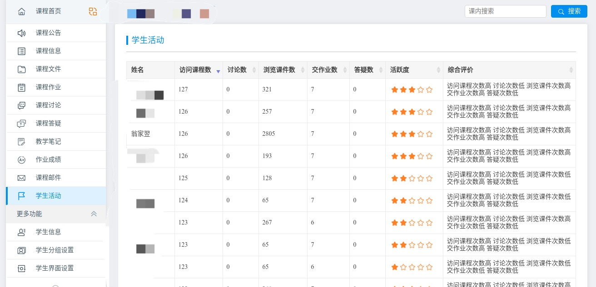

# 清华大学新版网络学堂课程自动下载脚本

## Features

0. 跨平台支持：Windows/Mac/Linux支持双击运行（[详情点击](https://github.com/Trinkle23897/learn2018-autodown/releases)）
1. 下载所有课程公告
2. 下载所有课件
3. 下载所有作业文件及其批阅情况
4. 下载所有课程讨论
5. 下载课程信息
6. 增量更新
7. 可选下载课程
8. 随时按Ctrl+C跳过某个文件的下载
9. 下载助教课程
10. 可使用cookie登录
11. 多刷刷有利于后台成绩提高，比如以下第三条记录是我的：



## Dependency

python>=3.5, bs4, tqdm, requests

```bash
pip3 install -r requirements.txt --user -U
```

## Usage

`learn-stdio.py` 中显示的参数和下面是一样的。

### 下载选项

下载当前学期课程（默认）
```bash
./learn.py
```
下载所有学期课程
```bash
./learn.py --all
```
下载指定学期课程
```bash
./learn.py --semester 2018-2019-1 2018-2019-3
```
下载指定课程
```bash
./learn.py --course 计算机网络安全技术 计算机组成原理
```
跳过某几个课程下载
```bash
./learn.py --ignore 数据结构 "实验室科研探究(1)"
```
移除所有文件夹下完全相同的文件
```bash
./learn.py --clear --all
```
以上参数均可组合使用，比如我想更新大二的课程，但是不想下载数据结构、实验室科研探究、中国近现代史纲要（课程文件太大了）：

```bash
./learn.py --semester 2017-2018-1 2017-2018-2 2017-2018-3 --ignore 数据结构 "实验室科研探究(2)" 中国近现代史纲要
```

**如果想跳过正在下载的某个文件，按Ctrl+C即可。**

### 登录选项（learn-stdio中禁用）

懒得每次输入info账号密码？创建文件`.pass`，写入info账号和密码之后可以自动登录，或者是：

```bash
./learn.py --_pass your_info_file
```

其中文件格式为 

```bash
info账号
info密码
```

使用Cookie登录而不是输入info密码：

```bash
./learn.py --cookie your_cookie_filename
```

其中cookie文件格式可参考 `example_cookie.txt`。

## Common Issues

- 卡在login：网络原因，看看pulse-secure关了没，重跑试试看
- `500 : Internal Server Error`：请拉取最新版的脚本。网络学堂自2020/2/22开启强制https。
- `info_xxx.csv`在Mac下打开是乱码：别用office，用mac自带的软件吧 :)
