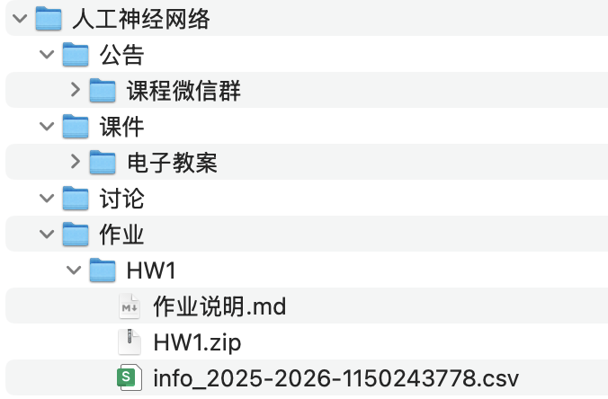
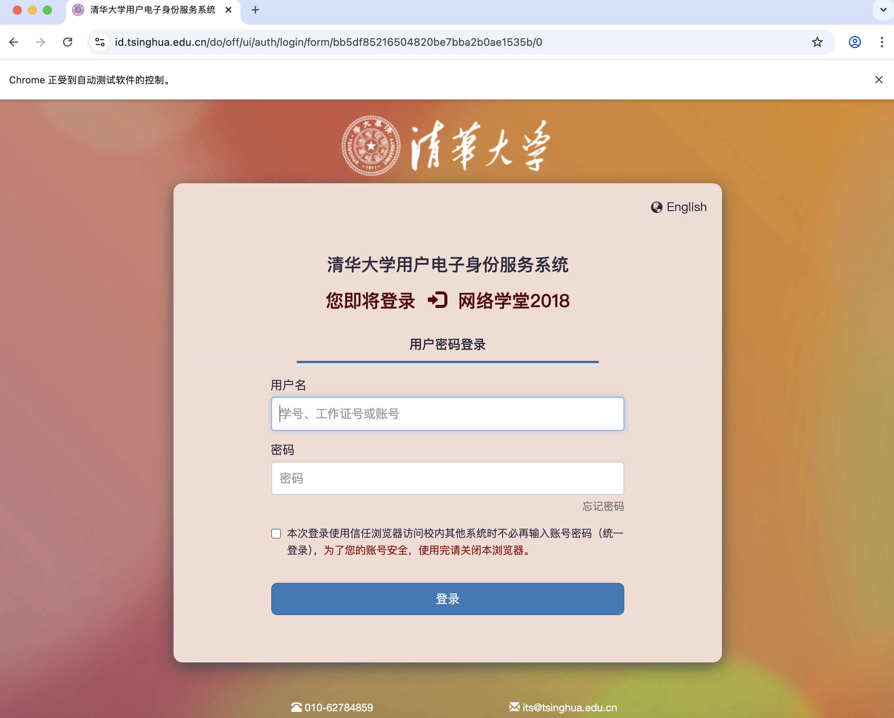
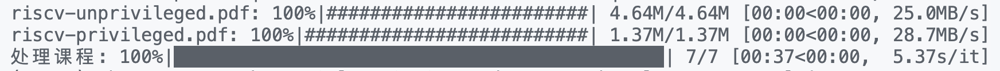

# 清华大学新版网络学堂课程自动下载脚本

## ✨ Features

### 🔐 认证与登录

- **新版 SSO 支持**: 完全兼容清华大学网络学堂新的双因素认证登录系统

### 📚 内容下载

- **全面覆盖**: 一键下载课程公告、课件、作业文件、讨论内容和课程信息
- **作业管理**: 下载作业文件及其详细批阅情况
- **助教课程**: 支持下载助教相关课程内容

### ⚡ 性能与效率

- **增量更新**: 智能检测文件变化，只下载新增或更新的内容
- **多进程下载**: 支持并发下载，显著提升下载速度
- **进度可视化**: 实时显示下载进度和状态

### 🛠️ 高度可定制

- **灵活筛选**: 自由选择下载的课程、学期和内容类型
- **路径自定义**: 支持指定下载路径和文件组织结构
- **排除机制**: 可跳过指定课程或文件类型

### 🌐 跨平台兼容

- **多平台支持**: 完美运行于 Windows、macOS 和 Linux

### 📸 下载示例



## 🚀 Quick Start

### 📦 依赖安装与测试

1. **安装 Chrome 浏览器**

   - [下载 Chrome](https://www.google.com/chrome/)
   - 确保 Chrome 已正确安装并可正常启动

2. **安装 Python 依赖**

   > python>=3.10, bs4, tqdm, requests, selenium, gmssl

   ```bash
   pip3 install -r requirements.txt
   ```

3. **运行脚本测试**
   ```bash
   python learn.py
   ```

- 程序会自动打开 Chrome 浏览器，需手动在浏览器中完成登录（支持双因素认证）
  
- 登录成功后浏览器跳转到网络学堂界面，脚本程序自动提取会话并开始下载。<br/> 在此过程中，**请勿关闭浏览器界面**；你可以通过脚本程序的输出监控下载进度。
  

### ⚠️ 注意事项

- **登录时不要关闭浏览器窗口**
- 确保网络连接正常

### 🔧 完整使用

**下载当前学期课程（默认）**

```bash
python learn.py
```

**启用多进程下载（推荐）**

```bash
python learn.py --multi
```

**指定下载路径**

```bash
python learn.py --dist your_download_path
```

下载所有学期课程

```bash
python learn.py --all
```

下载指定学期课程

```bash
python learn.py --semester 2018-2019-1 2018-2019-3
```

下载指定课程

```bash
python learn.py --course 计算机网络安全技术 计算机组成原理
```

跳过某几个课程下载

```bash
python learn.py --ignore 数据结构 "实验室科研探究(1)"
```

移除所有文件夹下完全相同的文件

```bash
python learn.py --clear --all
```

启用多进程下载，并指定进程数（如果不指定则默认使用所有 CPU 核心数）

```bash
python learn.py --multi --processes 4
```

以上参数均可组合使用，比如我想并发的更新大二的课程到`./download`目录，但是不想下载数据结构、实验室科研探究、中国近现代史纲要（课程文件太大了）：

```bash
python learn.py --semester 2017-2018-1 2017-2018-2 2017-2018-3 --ignore 数据结构 "实验室科研探究(2)" 中国近现代史纲要 --multi --dist ./download
```

**如果想跳过正在下载的某个文件，按 Ctrl+C 即可。**

## 🔧 Common Issues

- **浏览器会话无效**：
  1. 删除目录下的 `session.json`文件后重新运行脚本
  2. （小概率）某些网站可能会检查 User-Agent 与实际请求的一致性，在 codespace 中搜索 `imcompatible os` 并按相关注释更改
- **双因素认证问题**：首次使用可能需要在浏览器中完成设备信任，程序会自动处理大部分情况
- **下载速度慢**：
  1. 启用多进程下载，并指定进程数（如果不指定则默认使用所有 CPU 核心数）
  2. 关闭 VPN 等代理工具
